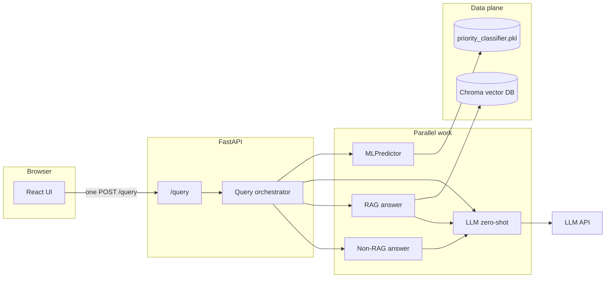

# Decision Intelligence Assistant

Production-style FastAPI backend and React frontend that compare **ML vs LLM** ticket priority and **RAG vs non-RAG** answers on the **same** customer message. A single `POST /query` runs all four branches in parallel.

## Architecture



- **ML path**: Random Forest on engineered text features; **$0** API cost; latency is local CPU.
- **LLM zero-shot path**: One short chat completion; cost from **actual** prompt/completion token counts × list-price rates in `llm_client.py` (reconcile with your invoice for billing).
- **RAG path**: Chroma cosine retrieval → grounded answer via the same LLM client.
- **Non-RAG path**: LLM-only answer with no retrieval.

## Prerequisites

- Python **3.11+** (backend), Node **20+** (frontend).
- Trained model files under `models/` (`priority_classifier.pkl`, `feature_columns.json`).
- Optional but expected for full RAG: populated Chroma directory under `data/chroma_db` (or `CHROMA_PERSIST_DIRECTORY`).
- **OpenAI** (or Groq/Gemini) API key in `backend/.env` — never commit secrets.

## Environment variables

Copy `backend/.env.example` to `backend/.env` and set at least:

| Variable | Purpose |
|----------|---------|
| `LLM_PROVIDER` | `openai` (default), `groq`, or `gemini` |
| `OPENAI_API_KEY` | Required when `LLM_PROVIDER=openai` |
| `OPENAI_MODEL` | e.g. `gpt-4o-mini` |
| `CHROMA_PERSIST_DIRECTORY` | Optional override for Chroma persist path |
| `LOG_DIR` | Optional; enables rotating `app.log` under that directory |

## Local development

**Backend** (from `backend/`):

```bash
cd backend
uv sync
uv sync --extra dev
uv run uvicorn app.main:app --reload --host 127.0.0.1 --port 8000
```

**Frontend** (from `frontend/`):

```bash
cd frontend
npm install
npm run dev
```

Vite proxies `/query`, `/health`, `/predict`, and `/answer` to `http://127.0.0.1:8000`. The UI calls **only** `POST /query` for the main flow.

### Test backend before frontend

From `frontend/`:

```bash
npm run test:backend-first
```

This runs `backend/scripts/run_backend_tests.sh` (pytest + HTTP `/health` smoke) then `npm run build`.

Manual smoke with a live `/query` (needs API key and running server):

```bash
cd backend
RUN_LIVE_QUERY=1 uv run python scripts/smoke_api.py
```

## Docker

1. Ensure `backend/.env` exists (copy from `.env.example` and add your key).
2. Ensure `./models` contains the classifier artifacts.
3. From the **repository root**:

```bash
docker compose up --build
```

- **API**: [http://127.0.0.1:8000](http://127.0.0.1:8000) (Swagger at `/docs`).
- **UI**: [http://127.0.0.1:8080](http://127.0.0.1:8080) — Nginx proxies `/query` (and related routes) to the backend so the browser still issues a **single** `POST /query` on the same origin.
- **Volumes**: `chroma_data` persists `/app/data/chroma_db`; `app_logs` persists `/app/logs`.

First startup can be slow (sentence-transformers / embedding model download inside the backend image).

## Design decisions

- **One orchestrated endpoint** keeps latency predictable and avoids four round trips from the browser.
- **Token-derived cost** uses provider list prices and usage fields returned by the API, not guesses from character counts.
- **Chroma cosine distance** is converted to **similarity** `max(0, min(1, 1 - distance))` for transparent sourcing in the UI.
- **Retries** on the OpenAI-compatible path use exponential backoff for rate limits and transient network errors (`tenacity`).

## Known limitations

- LLM throughput at **10,000 tickets/hour** depends on provider rate limits, batching, and regional capacity — not modeled here.
- RAG quality depends on ingestion coverage and embedding model alignment with your support corpus.
- `TextBlob` sentiment and keyword heuristics in ML features are simple; the RF still reflects your weak labels from training.

## Which priority predictor at 10,000 tickets/hour?

**Deploy the ML (Random Forest) predictor as the default automated triage**, with optional LLM escalation for edge cases.

- **Cost**: At 10k tickets/hour, ML adds essentially **no marginal API cost**; LLM zero-shot multiplies **every** ticket by at least one short completion charge (see the in-app comparison table: cost × 10,000).
- **Latency & reliability**: ML inference is milliseconds on CPU and easy to replicate horizontally; LLM calls add variable network latency and external dependency.
- **Where LLM still wins**: Nuanced language, novel intents, or policy-heavy phrasing may justify **human-in-the-loop** or **LLM second pass** for a subset — but not as the sole gate for every ticket at this scale.

If you pasted an API key into chat or a ticket, **rotate it immediately** in the provider console and keep keys only in `backend/.env`.

## API testing (CLI)

1. Start the server from `backend/`: `uv run uvicorn app.main:app --reload --host 127.0.0.1 --port 8000`
2. **Automated HTTP suite** (second terminal, from `backend/`):

   ```bash
   export BASE=http://127.0.0.1:8000
   uv run python scripts/cli_api_tests.py
   ```

   Skip expensive LLM calls (validation + ML + docs only):

   ```bash
   uv run python scripts/cli_api_tests.py --skip-llm
   ```

   Skip ML (no `models/` on disk):

   ```bash
   uv run python scripts/cli_api_tests.py --skip-ml --skip-llm
   ```

3. **Offline validation** (no server): `uv run --extra dev pytest tests/test_api_validation.py -q`
