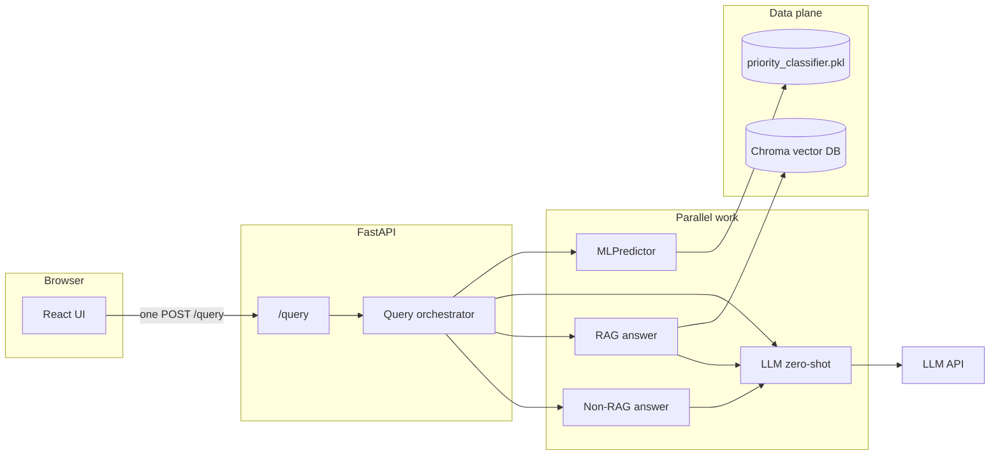

# Decision Intelligence Assistant

Production-style FastAPI backend + React frontend that run **four answering
strategies on the same customer-support ticket in parallel** and expose a
single `POST /query` endpoint that returns all four side-by-side:

1. **ML** — local Random Forest priority classifier (`urgent` / `normal`).
2. **LLM zero-shot** — the same priority question, answered by an LLM.
3. **RAG** — Chroma retrieval over historical tickets → grounded answer.
4. **Non-RAG** — LLM-only answer with no retrieval (control group).

Every call returns latency, token counts, per-request cost, and sources, so the
UI (and graders) can compare cost/quality/latency of each path on the same
input.

---

## Architecture



- **ML path** — Random Forest on engineered text + metadata features. $0 API
  cost; latency is local CPU.
- **LLM zero-shot path** — one short chat completion; cost is derived from the
  API's actual token counts × list-price rates in `backend/app/services/llm_client.py`.
- **RAG path** — Chroma cosine retrieval → prompt-stuffed grounded answer via
  the same LLM client.
- **Non-RAG path** — LLM-only answer with no retrieval.

All four run concurrently via `asyncio.gather` inside the query orchestrator,
so end-to-end latency ≈ `max(ML, zero-shot, RAG, non-RAG)` rather than their
sum.

---

## Repository layout

```
decision-assistant/
├── backend/                 # FastAPI service
│   ├── app/
│   │   ├── main.py              # app factory + root middleware
│   │   ├── api/routers/         # /health, /query, /predict, /answer
│   │   ├── schemas/             # Pydantic request/response models
│   │   ├── services/            # orchestrator, RAG, ML, LLM clients
│   │   └── core/                # config + logging setup
│   ├── scripts/             # ingest_conversations.py, smoke_api.py, CLI tests
│   ├── tests/               # pytest suite
│   ├── Dockerfile
│   ├── railway.json
│   ├── pyproject.toml           # single source of truth for backend deps
│   └── README.md
├── frontend/                # Vite + React UI
│   ├── src/
│   │   ├── App.tsx              # 4-panel comparison view
│   │   ├── queryApi.ts          # POST /query client
│   │   └── evalMetrics.ts       # cost × 10k-ticket projections
│   ├── nginx.conf.template      # envsubst'd at container start
│   ├── docker-entrypoint.sh     # renders nginx config before nginx boots
│   ├── Dockerfile               # multi-stage: node build → nginx runtime
│   ├── railway.json
│   └── package.json
├── notebooks/               # EDA → labeling → features → training pipeline
│   └── README.md                # numbered index of every notebook
├── data/                    # raw + cleaned CSVs (gitignored)
├── models/                  # priority_classifier.pkl, feature_columns.json
├── docker-compose.yml
├── .env.example
├── .dockerignore
├── .gitattributes
└── README.md                (this file)
```

---

## Notebooks — where the ML work lives

Full index and per-notebook I/O contracts live in
[`notebooks/README.md`](notebooks/README.md). Short version:

| Order | Notebook | Purpose |
|:-:|---|---|
| 1 | `02_load_inspect_full.ipynb` | Load + validate raw Twitter support dataset |
| 2 | `03_process_conversations_full.ipynb` | Thread tweets into conversations, derive columns |
| 3 | `08_eda_and_cleaning.ipynb` | **EDA** + RAG-safe cleaning → ML view + RAG view |
| 4 | `09_data_quality_checkpoint.ipynb` | Invariants / quality gate after cleaning |
| 5 | `10_priority_labeling.ipynb` | **Labeling logic** — weak-supervision `urgent` / `normal` |
| 6 | `10_eda_validation_cleaned.ipynb` | EDA on cleaned + labeled corpus |
| 7 | `11_ml_features_train.ipynb` | **Feature engineering** + train/val/test split |
| 8 | `12_ml_training_pipeline.ipynb` | **Model comparison** + export `priority_classifier.pkl` |

Together these cover all four EDA / labeling / feature engineering / model
comparison requirements.

---

## Quick start — Docker (recommended)

### 1. Prerequisites

- Docker Desktop 4.30+ (or Docker Engine 24+ with Compose v2).
- An LLM provider API key (OpenAI by default).

### 2. Configure `.env`

```bash
cp .env.example .env
# Open .env and set at least:
#   OPENAI_API_KEY=sk-...
# All other variables have sensible defaults that match docker-compose.yml.
```

### 3. Run the stack

```bash
# Build images + start everything; Ctrl+C to stop.
docker compose up --build

# Or detached:
docker compose up --build -d
docker compose logs -f backend     # tail a single service
```

### 4. Open the UI

- **http://localhost:8080** (override with `FRONTEND_HOST_PORT` in `.env`)
- The browser only ever talks to that one origin. Requests to
  `/query`, `/health`, `/predict`, `/answer` are reverse-proxied by nginx to
  `backend:8000` on the internal Docker network.

### 5. Ingest tickets into the vector store (optional, for RAG)

The `chroma_data` volume starts empty. To enable the RAG panel:

```bash
# Put data/cleaned/conversations_for_rag.csv in place first, then:
docker compose run --rm backend python scripts/ingest_conversations.py
```

The ingest script writes into the named volume, so every future
`docker compose up` reuses the populated index.

### 6. Stop / rebuild / wipe

```bash
docker compose down            # stop; keep volumes
docker compose down -v         # stop AND wipe chroma_data + app_logs
docker compose build --no-cache   # rebuild ignoring cache
docker compose up -d --build backend   # rebuild just one service
```

---

## Docker architecture details

### Services

| Service    | Base image           | Role                                                          | Host port                    |
|------------|----------------------|---------------------------------------------------------------|------------------------------|
| `backend`  | `python:3.12-slim`   | FastAPI (`/health`, `/query`, `/predict`, `/answer`)          | **none** (internal only)     |
| `frontend` | `nginx:1.27-alpine`  | Static Vite build + reverse proxy to `backend:8000`           | `${FRONTEND_HOST_PORT:-8080}` |
| Vector DB  | —                    | **In-process Chroma (persistent mode)** inside `backend`      | —                            |

**Why no separate `vector-db` service?** Chroma in persistent mode is an
in-process library, not a network server. Running it as its own service would
mean adopting the (separate) Chroma HTTP server, which doubles memory use, adds
a network hop per retrieval, and provides no benefit with a single backend
replica. The persisted index lives on a named volume (`chroma_data`), so it
survives restarts exactly like a standalone DB would. If the backend ever
needs to scale horizontally, swap in Qdrant or Chroma's HTTP server as a third
service — the retriever interface in
`backend/app/services/vector_store.py` is the only code that would change.

### Shared network

An explicit bridge network `app_network` is declared in `docker-compose.yml`.
Both services join it, so nginx can resolve the backend by service name
(`http://backend:8000`) — **never** via `localhost`. This is the foundation of
the "no localhost between services" constraint.

### Named volumes

| Volume          | Mount point                | Purpose                                    |
|-----------------|----------------------------|--------------------------------------------|
| `chroma_data`   | `/app/data/chroma_db`      | Persistent Chroma index (survives restarts) |
| `app_logs`      | `/app/logs`                | Rotating `app.log` + request logs           |

Both survive `docker compose down`; only `down -v` wipes them.

A **bind mount** of `./models:/models:ro` keeps the Random Forest pickle
outside the image so you can rotate it without a rebuild.

### Port exposure

Only the frontend is published to the host — `${FRONTEND_HOST_PORT}` → `80`
inside the container. The backend declares `expose: ["8000"]` but not `ports:`,
so `curl http://localhost:8000` from the host fails by design: the only path
in is through nginx.

### Secrets & configuration

All secrets load from `.env` via `env_file:` in `docker-compose.yml`. Nothing is
hardcoded in the Dockerfiles or source. `.env.example` ships with every
variable the stack needs; `.env` is gitignored.

---

## Environment variables

Full list (every variable the stack recognises):

| Variable                   | Where it's used                              | Default (in compose)            |
|----------------------------|----------------------------------------------|---------------------------------|
| `LLM_PROVIDER`             | Backend — picks OpenAI / Groq / Gemini path  | `openai`                        |
| `OPENAI_API_KEY`           | Backend — required when provider=openai      | *(empty; user supplies)*        |
| `OPENAI_MODEL`             | Backend — chat model                         | `gpt-4o-mini`                   |
| `GROQ_API_KEY` / `_MODEL` / `_BASE_URL` | Backend — alternative provider | *(commented)*                   |
| `GEMINI_API_KEY` / `_MODEL` | Backend — alternative provider              | *(commented)*                   |
| `CHROMA_PERSIST_DIRECTORY` | Backend — Chroma index path                  | `/app/data/chroma_db`           |
| `LOG_DIR`                  | Backend — directory for rotating `app.log`   | `/app/logs`                     |
| `FRONTEND_HOST_PORT`       | Compose — host port for the UI               | `8080`                          |
| `BACKEND_HOST`             | Frontend — nginx upstream                    | `backend`                       |
| `BACKEND_PORT`             | Frontend — nginx upstream port               | `8000`                          |

---

## API reference

| Method | Path        | Purpose                                                             |
|--------|-------------|---------------------------------------------------------------------|
| GET    | `/health`   | Liveness probe. Returns `{"status":"ok","timestamp_utc":...}`       |
| POST   | `/query`    | **Main entry point.** Runs ML + LLM-zero-shot + RAG + non-RAG in parallel. |
| POST   | `/predict`  | ML-only priority (fast, cheap)                                      |
| POST   | `/answer`   | RAG answer only, no priority                                        |

Request/response schemas live in `backend/app/schemas/`. A live Swagger doc
is available at `http://backend:8000/docs` from inside the compose network
(not exposed publicly).

---

## Logging

The backend writes structured logs in three places:

1. **stdout** (captured by `docker compose logs`) — every request line:
   ```
   2026-04-24 03:54:40 | INFO | app.main | POST /query -> 200 in 1834.02ms
   ```
2. **Rotating file** — `/app/logs/app.log` (5 MB × 5 backups) via
   `backend/app/core/logging_config.py`. Persisted on the `app_logs` volume.
3. **Per-service loggers** — each of `app.services.rag_retriever`,
   `app.services.ml_predictor`, `app.services.llm_client` emits its own
   records, so a single grep can reconstruct:
   - the incoming query text + user-agent,
   - the Chroma retrieval hits + cosine similarities,
   - the LLM prompt tokens + completion tokens + usd cost,
   - the final answer + latency per branch.

Tail live:

```bash
docker compose exec backend tail -f /app/logs/app.log
```

---

## Local development (without Docker)

Useful when iterating on backend code with hot-reload. Requires Python 3.11+
(using [`uv`](https://docs.astral.sh/uv/)) and Node 20+.

```bash
# Backend (hot reload)
cd backend
uv sync
uv sync --extra dev
cp .env.example .env           # then set OPENAI_API_KEY
uv run uvicorn app.main:app --reload --host 127.0.0.1 --port 8000

# Frontend (Vite dev server proxies to :8000)
cd ../frontend
npm install
npm run dev
# Open http://localhost:5173
```

Tests:

```bash
cd backend
uv run --extra dev pytest -q                    # unit tests
RUN_LIVE_QUERY=1 uv run python scripts/smoke_api.py   # live /query smoke
uv run python scripts/cli_api_tests.py --skip-llm     # HTTP suite, no API spend
```

---

## Railway deployment

Railway runs each service in its own container sharing a private per-project
network. The repo ships two `railway.json` files so Railway knows which
Dockerfile to use for each service.

### Critical: root directory must be the **repository root**

Both `backend/Dockerfile` and `frontend/Dockerfile` use **`COPY backend/...`**
and **`COPY frontend/...`** with **`buildContext: "."`** in `railway.json`.
That means the Docker build context is always the **top of the repo**, not the
`backend/` or `frontend/` folder alone.

| Wrong (build fails: missing `backend/` or `frontend/` in context) | Correct |
|---|---|
| Root directory = `backend` | Root directory = **empty** or `/` (repo root) |
| Root directory = `frontend` | Same for the frontend service |

For each Railway service, set **Config file** (or point Railway at) the right
JSON: `backend/railway.json` vs `frontend/railway.json`. Railway still builds
from the **same** repo root; the JSON only selects which Dockerfile runs.

### How traffic flows (Docker Compose vs Railway)

| Hop | Docker Compose | Railway |
|-----|----------------|---------|
| Browser | `http://localhost:8080` (only published port) | Public URL on the **frontend** service only |
| Static UI + API reverse proxy | nginx in `frontend` container | same |
| Upstream for `/query`, `/health`, … | `http://backend:8000` on `app_network` | `http://<BACKEND_HOST>:8000` on Railway private DNS |
| FastAPI + Chroma | `backend` container | backend container |

The React app is built with **`VITE_API_BASE_URL` unset** so the browser uses
**same-origin** paths (`/query`, `/health`, …). nginx matches those paths and
`proxy_pass`es to the backend. The browser never needs the backend’s hostname.

On Railway, set **`BACKEND_HOST`** to the **private hostname** of your backend
service (Railway dashboard → backend service → **Networking** → copy the
internal address, often shaped like `<service-name>.railway.internal`). It must
match whatever you named the backend service (e.g. if you renamed it to
`api`, use `api.railway.internal`). **`BACKEND_PORT=8000`** unless you changed
the container port. **`PORT`** on the frontend is injected by Railway; nginx
listens on that port after `envsubst` renders `nginx.conf.template`.

1. **Create a new Railway project** → "Deploy from GitHub repo" → pick this repo.
2. **Add the `backend` service**
   - **Root directory:** repo root (leave blank / `/`).
   - **Config / Dockerfile:** use `backend/railway.json` (builds
     `backend/Dockerfile` with context `.`).
   - Healthcheck path: `/health` · timeout: **300s** (first boot loads the
     embedding model).
   - **Volume:** mount ~1 GB at **`/app/data/chroma_db`** (matches
     `CHROMA_PERSIST_DIRECTORY` in the example env).
   - **Variables:** `LLM_PROVIDER`, `OPENAI_API_KEY`, `OPENAI_MODEL`,
     `CHROMA_PERSIST_DIRECTORY=/app/data/chroma_db`, `LOG_DIR=/app/logs`.
     Do **not** set `PORT` manually — Railway injects it; the image CMD uses
     `${PORT:-8000}`.
   - Do **not** generate a public domain — backend stays private.
3. **Add the `frontend` service**
   - **Root directory:** same repo root (blank / `/`).
   - **Config:** `frontend/railway.json`.
   - **Variables:** `BACKEND_HOST=<paste backend private hostname>`,
     `BACKEND_PORT=8000`. Leave **`PORT`** unset so Railway can inject the
     listen port for nginx.
   - Generate a **public domain** on this service only — that is the app URL.
4. **Seed the vector store** — one-off run on the backend service:
   `python scripts/ingest_conversations.py` (with your CSV available in the
   volume or image) when you want RAG live.

### Known gap — "deploy even with the error"

If `models/priority_classifier.pkl` or the Chroma index are missing on first
deploy, the app still boots:

- `/health` returns OK.
- `/query` returns a partial result: ML and RAG branches 5xx individually but
  the non-RAG LLM branch still answers.
- Fill the volumes (ingest script + model upload) — no redeploy required.

---

## Design decisions

- **One orchestrated endpoint.** `POST /query` runs all four branches in
  parallel so the browser makes a single round trip. Latency is bounded by the
  slowest branch, not their sum.
- **Real token-derived cost.** Cost numbers use the provider's usage
  fields (`prompt_tokens`, `completion_tokens`) × list-price rates in
  `llm_client.py` — never character counts. Reconcile with the provider
  invoice for billing.
- **Chroma distance → similarity.** UI displays
  `max(0, min(1, 1 − cosine_distance))` so scores are always in `[0, 1]`.
- **`tenacity` retries with exponential backoff** on every OpenAI-compatible
  call (rate limits + transient network errors).
- **CPU-only PyTorch** is installed from the PyTorch CPU index before the main
  `pip install`, preventing the 2 GB CUDA stack from being pulled into the
  backend image.
- **Non-root containers.** Both images run as an unprivileged user (UID 10001
  in backend, nginx built-in in frontend).
- **nginx env-templating.** `nginx.conf.template` + `docker-entrypoint.sh`
  run `envsubst` at container start so `BACKEND_HOST` and `PORT` can change
  per environment (compose → `backend`, Railway → `backend.railway.internal`)
  without rebuilding the image.

---

## Known limitations

- **10 000 tickets/hour throughput** depends on provider rate limits, batching,
  and regional capacity — not modeled in this repo. See the in-UI comparison
  table for the per-path cost × 10 000.
- **RAG quality** is bounded by ingestion coverage and how well the embedding
  model aligns with the support corpus. Re-run
  `scripts/ingest_conversations.py` after adding new tickets.
- **Weak-supervision labels** in `10_priority_labeling.ipynb` are heuristic;
  the Random Forest reflects those labels, not gold ground-truth. Accuracy
  numbers in `12_ml_training_pipeline.ipynb` are on held-out *weakly-labeled*
  data.
- **`xgboost` dependency** pulls a 300 MB NCCL library on Linux even though we
  only use CPU inference. `xgboost` does not publish a CPU-only wheel on
  PyPI, so this overhead is accepted.
- **First container start** is slow (~90 s backend) because
  `sentence-transformers` downloads the embedding model into the image cache
  on the first run. Subsequent starts are fast.

---

## Which priority predictor would you deploy at 10 000 tickets/hour?

**Deploy the ML Random Forest as the default automated triage**, with
optional LLM escalation for edge cases.

- **Cost.** At 10 k tickets/hour, ML adds essentially **no** marginal API
  cost. LLM zero-shot multiplies every ticket by at least one short-completion
  charge — see the in-app comparison table (`cost × 10 000`).
- **Latency & reliability.** ML inference is milliseconds on CPU and easy to
  replicate horizontally. LLM calls add variable network latency and external
  dependency.
- **Where LLM still wins.** Nuanced language, novel intents, or
  policy-heavy phrasing may justify **human-in-the-loop** or an **LLM second
  pass** for a subset — but not as the sole gate for every ticket at this
  scale.

---

## Security

If you pasted a real API key into a chat or a ticket at any point, **rotate
it immediately** in the provider console. Keep keys only in the local
`.env` file, which is gitignored.
