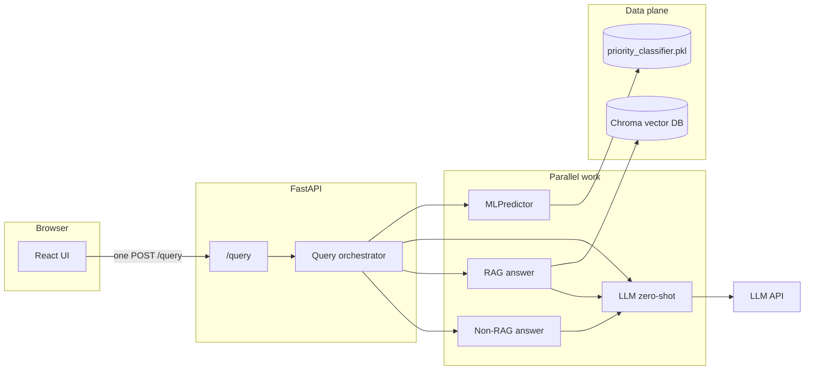

# Decision Intelligence Assistant

Production-style FastAPI backend and React frontend that compare **ML vs LLM** ticket priority and **RAG vs non-RAG** answers on the **same** customer message. A single `POST /query` runs all four branches in parallel.

## Architecture



- **ML path**: Random Forest on engineered text features; **$0** API cost; latency is local CPU.
- **LLM zero-shot path**: One short chat completion; cost from **actual** prompt/completion token counts × list-price rates in `llm_client.py` (reconcile with your invoice for billing).
- **RAG path**: Chroma cosine retrieval → grounded answer via the same LLM client.
- **Non-RAG path**: LLM-only answer with no retrieval.

## Prerequisites

- Python **3.11+** (backend), Node **20+** (frontend).
- Trained model files under `models/` (`priority_classifier.pkl`, `feature_columns.json`).
- Optional but expected for full RAG: populated Chroma directory under `data/chroma_db` (or `CHROMA_PERSIST_DIRECTORY`).
- **OpenAI** (or Groq/Gemini) API key in `backend/.env` — never commit secrets.

## Environment variables

Copy `backend/.env.example` to `backend/.env` and set at least:

| Variable | Purpose |
|----------|---------|
| `LLM_PROVIDER` | `openai` (default), `groq`, or `gemini` |
| `OPENAI_API_KEY` | Required when `LLM_PROVIDER=openai` |
| `OPENAI_MODEL` | e.g. `gpt-4o-mini` |
| `CHROMA_PERSIST_DIRECTORY` | Optional override for Chroma persist path |
| `LOG_DIR` | Optional; enables rotating `app.log` under that directory |

## Local development

**Backend** (from `backend/`):

```bash
cd backend
uv sync
uv sync --extra dev
uv run uvicorn app.main:app --reload --host 127.0.0.1 --port 8000
```

**Frontend** (from `frontend/`):

```bash
cd frontend
npm install
npm run dev
```

Vite proxies `/query`, `/health`, `/predict`, and `/answer` to `http://127.0.0.1:8000`. The UI calls **only** `POST /query` for the main flow.

### Test backend before frontend

From `frontend/`:

```bash
npm run test:backend-first
```

This runs `backend/scripts/run_backend_tests.sh` (pytest + HTTP `/health` smoke) then `npm run build`.

Manual smoke with a live `/query` (needs API key and running server):

```bash
cd backend
RUN_LIVE_QUERY=1 uv run python scripts/smoke_api.py
```

## Docker stack (single command)

The whole stack — FastAPI backend, React frontend (served by nginx), and the
Chroma vector store — comes up with one command from the repo root.

### Services

| Service    | Image base            | Role                                                          | Host port        |
|------------|-----------------------|---------------------------------------------------------------|------------------|
| `backend`  | `python:3.12-slim`    | FastAPI — `/health`, `/query`, `/predict`, `/answer`          | **none** (internal only) |
| `frontend` | `nginx:1.27-alpine`   | Serves the Vite build and reverse-proxies all `/api` routes to `backend:8000` | `${FRONTEND_HOST_PORT:-8080}` |
| Vector DB  | —                     | **In-process Chroma (persistent mode)**, lives inside `backend` | — |

**Why no separate `vector-db` service?** Chroma in persistent mode is an
in-process library, not a network server. Running it as its own service would
mean adopting the (separate) Chroma HTTP server, which would double memory use,
add an extra network hop per retrieval, and give us nothing here because we
only have a single backend replica. The persisted index lives on the named
volume `chroma_data`, so it survives restarts exactly like a standalone DB
would. If the backend is ever horizontally scaled, swap in Qdrant or the Chroma
HTTP server as a third service — the retriever interface in
`backend/app/services/vector_store.py` is the only place that would change.

### Shared network and volumes

- `app_network` (bridge) is declared explicitly in `docker-compose.yml`. All
  services join it, so `frontend` resolves the backend as `http://backend:8000`
  — **never** via `localhost`.
- Named volumes: `chroma_data` (→ `/app/data/chroma_db`), `app_logs`
  (→ `/app/logs`). Both survive `docker compose down`; use
  `docker compose down -v` to wipe them.
- Host mount: `./models` → `/models:ro` so the Random Forest pickle stays
  outside the image and can be rotated without a rebuild.

### Ports

Only one port is published to the host: the frontend (`${FRONTEND_HOST_PORT}`,
default `8080`). The backend exposes `8000` on the internal network only
(`expose:` in compose, not `ports:`), so the browser can **only** reach it
through nginx — no one can `curl http://localhost:8000` from outside the stack.

### First-time setup

```bash
cp .env.example .env
# Edit .env and set at least OPENAI_API_KEY (or GROQ_API_KEY / GEMINI_API_KEY).
# Optional: drop priority_classifier.pkl and feature_columns.json into ./models
# so the ML predictor works. Without them /predict and the ML branch of /query
# return a 5xx; the RAG and non-RAG branches still work.
```

### Run / stop / rebuild

```bash
# Start (builds images on first run, reuses cache afterwards)
docker compose up --build

# Same thing, detached
docker compose up --build -d

# Tail logs for one service
docker compose logs -f backend

# Stop, keep data
docker compose down

# Stop AND wipe chroma_data + app_logs (destructive)
docker compose down -v

# Rebuild from scratch (no cache — use after changing Dockerfiles or deps)
docker compose build --no-cache
docker compose up -d

# Rebuild just one service
docker compose up -d --build backend
```

Once up:

- UI: http://localhost:${FRONTEND_HOST_PORT:-8080}
- The browser hits **only** that origin. `/query`, `/health`, `/predict`,
  `/answer` are proxied by nginx to `backend:8000` over `app_network`.
- Swagger: **not** exposed publicly. To poke the API directly during dev, run
  `docker compose exec backend curl -s http://127.0.0.1:8000/docs` from inside
  the stack, or add a temporary `ports: ["8000:8000"]` block to the backend
  service.

First startup is slow (~1–3 min) because `sentence-transformers` downloads the
embedding model into the image layer cache. Subsequent `up` calls are fast.

### Populating the vector store

The `chroma_data` volume starts empty. Ingest the cleaned CSV once:

```bash
# Put data/cleaned/conversations_for_rag.csv in place first.
docker compose run --rm backend python scripts/ingest_conversations.py
```

That run writes into the named volume and every future `docker compose up`
reuses it.

## Railway deployment

Railway does not run `docker-compose` directly — each service is its own
Railway service sharing the project's private network. The repo ships two
`railway.json` files (`backend/railway.json`, `frontend/railway.json`) so
Railway builds each with the right Dockerfile.

1. **Create a new Railway project** from this repo.
2. **Add service `backend`:**
   - Root directory: `/` (repo root, so the Dockerfile's `COPY backend/...`
     paths resolve).
   - Config file: `backend/railway.json` (Railway auto-detects it if you set
     the service's "Config Path").
   - Variables: `LLM_PROVIDER`, `OPENAI_API_KEY` (or Groq / Gemini equivalents),
     `CHROMA_PERSIST_DIRECTORY=/app/data/chroma_db`, `LOG_DIR=/app/logs`.
   - Volume: mount one named volume at `/app/data/chroma_db` (Railway → service
     → "Volumes" → "New Volume").
   - Leave `PORT` untouched — Railway injects it and the Dockerfile CMD honors
     it (`--port $PORT`).
3. **Add service `frontend`:**
   - Root directory: `/`.
   - Config file: `frontend/railway.json`.
   - Variables:
     - `BACKEND_HOST=backend.railway.internal` (replace `backend` if you named
       the service differently).
     - `BACKEND_PORT=8000`.
   - Railway injects `PORT` and the nginx template listens on it via
     `envsubst` at container start.
   - Enable a public domain on this service only. The backend stays
     private — browsers never talk to it directly.
4. **Push the ML artifacts** into the backend image or a Railway volume before
   expecting `/predict` to work. Easiest path: commit `models/` to a private
   branch used only for Railway builds, or add a one-off step that downloads
   them from object storage during build.

### Known gap — "deploy even with the error"

If `models/priority_classifier.pkl` or `data/cleaned/conversations_for_rag.csv`
are not present in the Railway volumes, the app still boots:

- `/health` returns OK.
- `/query` returns a 5xx only for the ML and RAG branches; the non-RAG LLM
  branch still answers.
- Fill the volumes (ingest script + model upload) and no redeploy is needed.

## Design decisions

- **One orchestrated endpoint** keeps latency predictable and avoids four round trips from the browser.
- **Token-derived cost** uses provider list prices and usage fields returned by the API, not guesses from character counts.
- **Chroma cosine distance** is converted to **similarity** `max(0, min(1, 1 - distance))` for transparent sourcing in the UI.
- **Retries** on the OpenAI-compatible path use exponential backoff for rate limits and transient network errors (`tenacity`).

## Known limitations

- LLM throughput at **10,000 tickets/hour** depends on provider rate limits, batching, and regional capacity — not modeled here.
- RAG quality depends on ingestion coverage and embedding model alignment with your support corpus.
- `TextBlob` sentiment and keyword heuristics in ML features are simple; the RF still reflects your weak labels from training.

## Which priority predictor at 10,000 tickets/hour?

**Deploy the ML (Random Forest) predictor as the default automated triage**, with optional LLM escalation for edge cases.

- **Cost**: At 10k tickets/hour, ML adds essentially **no marginal API cost**; LLM zero-shot multiplies **every** ticket by at least one short completion charge (see the in-app comparison table: cost × 10,000).
- **Latency & reliability**: ML inference is milliseconds on CPU and easy to replicate horizontally; LLM calls add variable network latency and external dependency.
- **Where LLM still wins**: Nuanced language, novel intents, or policy-heavy phrasing may justify **human-in-the-loop** or **LLM second pass** for a subset — but not as the sole gate for every ticket at this scale.

If you pasted an API key into chat or a ticket, **rotate it immediately** in the provider console and keep keys only in `backend/.env`.

## API testing (CLI)

1. Start the server from `backend/`: `uv run uvicorn app.main:app --reload --host 127.0.0.1 --port 8000`
2. **Automated HTTP suite** (second terminal, from `backend/`):

   ```bash
   export BASE=http://127.0.0.1:8000
   uv run python scripts/cli_api_tests.py
   ```

   Skip expensive LLM calls (validation + ML + docs only):

   ```bash
   uv run python scripts/cli_api_tests.py --skip-llm
   ```

   Skip ML (no `models/` on disk):

   ```bash
   uv run python scripts/cli_api_tests.py --skip-ml --skip-llm
   ```

3. **Offline validation** (no server): `uv run --extra dev pytest tests/test_api_validation.py -q`
